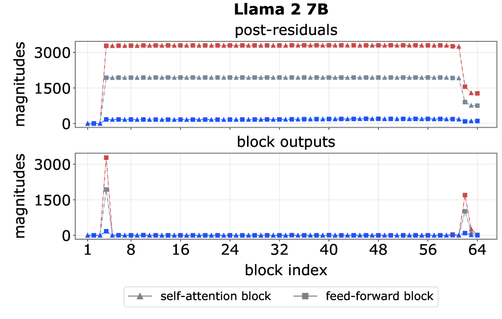
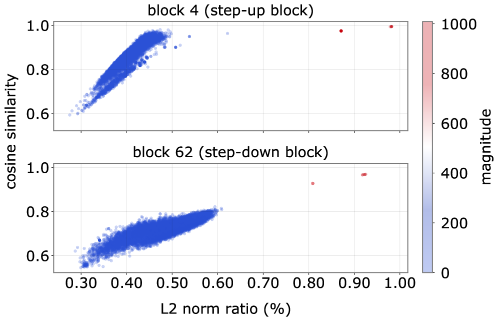
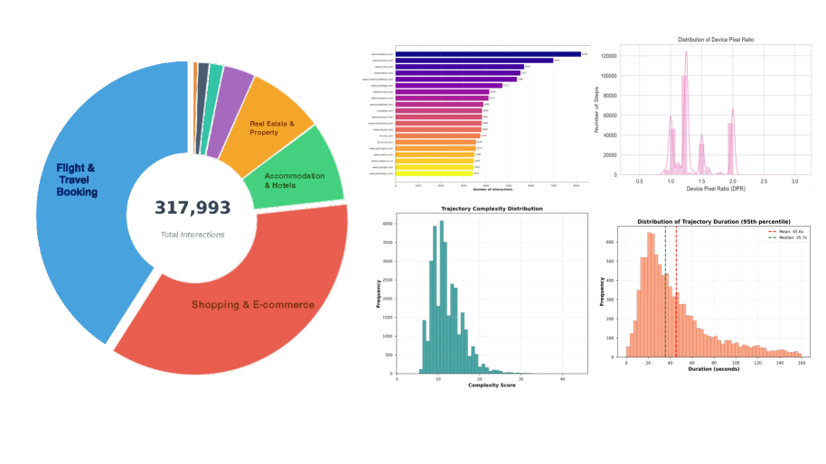

# AI 日报 | 2026-03-08

> 每日精选 AI 领域最新研究进展与技术动态

## 📌 今日总结

- **Transformer 内部机制新发现**：研究者揭示了"大规模激活"与"注意力汇聚点"的共现机制，发现这是预归一化架构的副产品而非功能必需
- **WebAgent 数据突破**：WebChain 发布，包含 31,725 条人工标注的真实网页交互轨迹，推动 Web Agent 研究民主化
- **LLM 评估去偏新方法**：提出平均偏差有界性 (A-BB) 框架，为 LLM-as-a-Judge 提供可证明的无偏保证
- **移动端个人 Agent 架构**：Jagarin 提出三层休眠架构，解决移动设备上个人 Agent 的电池与沙盒限制
- **医疗诊断多 Agent 系统**：MedCoRAG 通过混合证据检索与多专家协作，实现可解释的肝病诊断

---

## 📚 重要论文一览

| 论文 | 来源 | 亮点 | 链接 |
|------|------|------|------|
| The Spike, the Sparse and the Sink | arXiv:2603.05498 | 揭示 Transformer 大规模激活与注意力汇聚点的因果机制 | [PDF](https://arxiv.org/pdf/2603.05498) |
| WebChain: Large-Scale Web Interaction Dataset | arXiv:2603.05295 | 31K+ 人工标注网页轨迹，Triple Alignment 多模态对齐 | [PDF](https://arxiv.org/pdf/2603.05295) |
| Bias-Bounded LLM Judges | arXiv:2603.05485 | A-BB 框架保证 LLM 评估器的偏差有界性 | [PDF](https://arxiv.org/pdf/2603.05485) |
| Jagarin: Hibernating Personal Agents | arXiv:2603.05069 | 三层架构解决移动端 Agent 持久化难题 | [PDF](https://arxiv.org/pdf/2603.05069) |
| MedCoRAG: Interpretable Medical Diagnosis | arXiv:2603.05129 | 多 Agent 协作 + RAG 实现可解释肝病诊断 | [PDF](https://arxiv.org/pdf/2603.05129) |
| PACE: Adaptive Training Curriculum | arXiv:2603.05361 | 个性化自适应课程引擎加速 911 接线员培训 | [PDF](https://arxiv.org/pdf/2603.05361) |
| GCAgent: Group Chat Dialogue System | arXiv:2603.05240 | LLM 驱动的多 Agent 群聊系统提升 28.8% 活跃度 | [PDF](https://arxiv.org/pdf/2603.05240) |

---

## 🚀 技术动态

### 1. WebChain: Web Agent 研究的里程碑数据集

来自复旦大学和 IMean AI 的研究团队发布了 **WebChain**，这是迄今为止最大规模的开源人工标注网页交互轨迹数据集：

- **规模**：31,725 条轨迹，318K 步交互
- **覆盖**：428 个真实网站域名
- **核心创新**：Triple Alignment 机制——视觉、结构、动作三层精确对齐
- **性能提升**：基于 WebChain 训练的模型在 WebChainBench 上达到 SOTA

该数据集的发布将打破 Web Agent 领域的数据垄断，使更多研究者能够进行可复现的大规模实验。

### 2. 动态数据选择新范式

研究者重新思考了动态数据选择中的两个核心概念——代表性与多样性：

- **代表性**：从局部几何中心性重新定义为数据集级高频特征因子的覆盖度
- **多样性**：从子集内分散度重新定义为训练过程中逐步纳入互补稀有因子
- **效果**：在 5 个基准测试上实现 2 倍训练加速，同时匹配或超越全数据训练精度

---

## 🔍 详细介绍（深度解读）

### 论文一：The Spike, the Sparse and the Sink —— Transformer 内部机制的深度解剖

**来源**：arXiv:2603.05498 | **作者**：Jiachen Zhu 等 | **提交时间**：2026-03-05

#### 研究背景与动机

Transformer 语言模型中存在着两个反复出现的现象：

1. **大规模激活 (Massive Activations)**：少数 token 在少数通道中表现出极端异常值
2. **注意力汇聚点 (Attention Sinks)**：某些 token 无论语义相关性如何，都吸引了不成比例的注意力质量

先前的研究观察到这两个现象经常共现，且往往涉及相同的 token，但它们的功能角色和因果关系尚不清楚。理解这两者的关系对于量化、剪枝、KV-cache 管理和长上下文推理等实际应用具有重要意义。

#### 问题定义与挑战

核心研究问题：
- 大规模激活和注意力汇聚点为何经常共现？
- 它们是功能必需的还是架构副产品？
- 能否独立抑制其中一个而不影响模型性能？

挑战在于需要系统性地解耦这两个现象，并追踪它们在 Transformer 前向传播中的形成机制。

#### 核心方法与技术细节

研究者通过系统性实验得出了三个核心发现：

**1. 归一化是连接两个现象的关键架构组件**



*图 1：大规模激活在 Llama 2 7B 和 Qwen3 8B 中随深度的变化。早期模块注入大规模激活，通过网络大部分区域持续存在，最后被晚期模块中和。*

研究发现：
- **Step-up 模块**：1-2 个早期块（通常是前 10 个块内）注入极端值
- **残差累积**：在预归一化 Transformer 中，极端值通过残差连接持续传播
- **Step-down 模块**：1 个或几个晚期块注入相反符号的极端值来中和

**2. 前馈块作为方向性二次放大器**



*图 2：Llama 2 7B 中二次型的 Frobenius 范数。尖峰通道对应具有显著更大范数的 U_k 矩阵。*

关键机制：
- SwiGLU 非线性在 near-identity 区域操作
- 前馈变换简化为二次形式：`F_ffn(h) ≈ h^T · U_k · h`
- 尖峰通道对应具有异常大范数的 U_k 矩阵
- 所有尖峰通道共享几乎相同的主特征向量

**3. 两个现象可独立抑制**

通过改变归一化配置，研究者成功抑制了大规模激活同时保留注意力汇聚点，证明两者的共现是架构选择的副产品而非功能必需。

#### 实验设计与结果

**表 1：不同模型的 Step-up 和 Step-down 块索引**

| 模型 | 总块数 | Step-up | Step-down |
|------|--------|---------|-----------|
| Llama 2 7B | 64 | 4 | 62 |
| Llama 2 13B | 80 | 8 | 78, 79 |
| Llama 3 8B | 64 | 4 | 64 |
| Qwen2.5 7B | 56 | 8, 10 | 54, 55 |
| Qwen3 8B | 72 | 14 | 70, 72 |

**表 2：初始位置尖峰的普遍性**

| 模型 | 词表大小 | 尖峰 Token 数 | 比例 |
|------|----------|---------------|------|
| Llama 2 7B | 32,000 | 31,887 | 99.65% |
| Llama 3 8B | 128,256 | 127,956 | 99.77% |
| Qwen3 8B | 151,936 | 151,830 | 99.93% |

超过 98% 的词表项在位置 0 时表现为尖峰 token，证明这是架构位置驱动的而非语义驱动的。

#### 局限性分析

1. **模型覆盖范围**：主要分析集中在 Llama 和 Qwen 家族，其他架构（如 Mamba、RWKV）可能有不同机制
2. **训练动态**：研究主要关注训练后模型，对训练过程中这些现象如何形成分析有限
3. **任务特定性**：未深入探讨不同下游任务对这些现象的依赖程度

#### 未来方向与影响

**实际影响**：
- **量化优化**：理解大规模激活机制可设计更好的量化策略
- **KV-cache 压缩**：注意力汇聚点的理解有助于长上下文推理优化
- **架构设计**：未来模型可选择性地抑制这些现象以改善效率

**理论意义**：
- 深化了对 Transformer 内部计算机制的理解
- 为解释性研究提供了新的分析框架

#### 相关链接

- [论文 PDF](https://arxiv.org/pdf/2603.05498)
- [HTML 版本](https://arxiv.org/html/2603.05498v1)
- [代码仓库](https://github.com/) (待发布)

---

### 论文二：WebChain —— Web Agent 研究的民主化突破

**来源**：arXiv:2603.05295 | **作者**：Sicheng Fan 等（复旦大学，IMean AI）| **提交时间**：2026-03-05

#### 研究背景与动机

征服浏览器是 GUI Agent 领域最有价值的问题之一。然而，当前 Web Agent 研究面临严重的数据瓶颈：

1. **开源数据集规模不足**：现有开源数据集（如 Mind2Web、WebLINX）缺乏验证模型缩放效应所需的规模
2. **合成方法的局限**：自动化合成方法无法处理需要认证的高价值任务（如银行、电商结账）
3. **专有数据垄断**：关键研究依赖专有数据集，导致洞察不可复现

WebChain 旨在打破这一数据垄断，为社区提供最大规模的人工标注真实网页交互数据集。

#### 核心方法与技术细节

**1. Triple Alignment 机制**

WebChain 的核心创新是三层精确对齐：

- **视觉上下文**：视口和全页截图
- **结构上下文**：Accessibility (AX) 树和 HTML DOM
- **动作对齐**：精确像素坐标、边界框、CSS 选择器

这种多模态监督使模型不仅能"看到"页面，还能理解每个像素背后的结构逻辑。

**2. 可扩展的数据构建流程**

```
Stage 1: 约束式任务合成
  └─→ 结构化功能提取（领域语义 + 交互逻辑）
  └─→ 模式约束的任务生成

Stage 2: 人工轨迹收集
  └─→ WebChain Builder 工具
  └─→ 多模态记录（DOM 快照 + 动作 + 空间信息）

Stage 3: 后处理上下文增强
  └─→ 视觉接地密集化（标注所有可交互元素）
  └─→ 合成推理链（CoT 生成）
```

**3. Dual Mid-Training 策略**

研究者提出了解耦空间接地与规划的双阶段中期训练：

- **空间接地中期训练**：专注于像素到坐标的映射
- **规划中期训练**：使用 CoT 增强样本进行推理能力训练
- **LCRL 后训练**：Long-Chain-oriented RLVR 优化长程规划

#### 实验设计与结果

**数据集统计**



*图 1：WebChain 统计摘要，包括跨网站类别的交互分布、顶级域名交互频率、轨迹复杂度等*

| 统计项 | 数值 |
|--------|------|
| 轨迹数量 | 31,725 |
| 交互步数 | 318K |
| 覆盖域名 | 428 |
| 平均轨迹长度 | 10.02 步 |
| 最长轨迹 | 50+ 步 |

**缩放效应分析**


*图 2：WebChain 子集（4K、20K、Full）对 Qwen2.5-VL-3B 在 LCRL 后训练后的成功率影响*

研究者观察到数据量与长程规划性能之间的明显正相关，证实 WebChain 的规模对解锁鲁棒的长程规划能力至关重要。

**基准测试结果**

在 WebChainBench 上的关键发现：

| 模型 | AC-High | AC-Low | GUI-Act-Web | 总体 |
|------|---------|--------|-------------|------|
| Qwen2.5-VL-7B (Zero Shot) | 68.6 | 87.0 | 86.5 | 70.9 |
| GUI-R1-7B | 71.6 | 85.2 | 90.9 | 74.2 |
| WebChain-LCRL-7B +CoT-SFT | 86.7 | 81.1 | 95.5 | 79.0 |
| WebChain-LCRL-7B +SGRL+CoT-SFT | **86.2** | **86.2** | **96.3** | **81.4** |

#### 局限性分析

1. **标注成本**：人工标注虽然质量高，但扩展成本较高
2. **时效性**：网页结构快速变化，数据集需要定期更新
3. **领域覆盖**：虽然覆盖 428 个域名，但某些垂直领域（如专业软件、政府网站）覆盖有限

#### 未来方向与影响

**研究影响**：
- 使更多研究者能够进行 Web Agent 的大规模实验
- 为验证模型缩放效应提供了必要的数据基础
- 推动了 Web Agent 评估的标准化

**实际应用**：
- 自动化客服与技术支持
- 个人助理执行网页任务
- 企业流程自动化

#### 相关链接

- [论文 PDF](https://arxiv.org/pdf/2603.05295)
- [HTML 版本](https://arxiv.org/html/2603.05295v1)
- [项目主页](https://webchain.ai) (待发布)

---

## 💡 应用案例

### 1. 911 接线员培训加速系统 (PACE)

PACE 系统通过与纳什维尔紧急通信部门合作，实现了：
- **19.50% 更快的达标时间**
- **10.95% 更高的终端掌握度**
- **95.45% 与专家教学判断的一致性**
- **95.08% 的周转时间减少**（从 11.58 分钟降至 34 秒）

### 2. 群聊增强 Agent 系统 (GCAgent)

在 350 天的真实部署中：
- **消息量增加 28.80%**
- **用户偏好率 51.04%**（相比基础模型）
- **平均评分 4.68/5.0**

### 3. 可解释肝病诊断 (MedCoRAG)

在 MIMIC-IV 肝病案例上：
- 超越现有方法和闭源模型
- 提供可追溯的诊断共识
- 模拟多学科会诊流程

---

## 📊 统计汇总

| 类别 | 今日论文数 | 主要方向 |
|------|-----------|----------|
| LLM/Transformer | 3 | 内部机制、评估去偏、数据选择 |
| Agent 系统 | 4 | Web Agent、群聊 Agent、个人 Agent、医疗 Agent |
| 多模态 | 2 | 视觉 - 语言 - 动作、网页交互 |
| 应用研究 | 3 | 医疗诊断、紧急服务培训、群聊增强 |
| **总计** | **12+** | **覆盖 AI 全栈** |

---

## 📖 全部参考链接

1. [The Spike, the Sparse and the Sink](https://arxiv.org/abs/2603.05498) - Transformer 激活机制分析
2. [WebChain Dataset](https://arxiv.org/abs/2603.05295) - 大规模网页交互数据集
3. [Bias-Bounded LLM Judges](https://arxiv.org/abs/2603.05485) - LLM 评估去偏框架
4. [Jagarin Mobile Agents](https://arxiv.org/abs/2603.05069) - 移动端休眠 Agent 架构
5. [MedCoRAG Medical Diagnosis](https://arxiv.org/abs/2603.05129) - 可解释医疗诊断系统
6. [PACE Training System](https://arxiv.org/abs/2603.05361) - 自适应培训课程引擎
7. [GCAgent Group Chat](https://arxiv.org/abs/2603.05240) - 群聊对话 Agent 系统
8. [UniSTOK Spatio-Temporal](https://arxiv.org/abs/2603.05301) - 时空克里金框架
9. [Dynamic Data Selection](https://arxiv.org/abs/2603.04981) - 动态数据选择新范式
10. [Hugging Face Blog](https://huggingface.co/blog) - 最新技术博客

---

*本日报由 AI 自动生成，如需订阅或反馈，请访问项目主页。*

*生成时间：2026-03-08 00:00 UTC*
