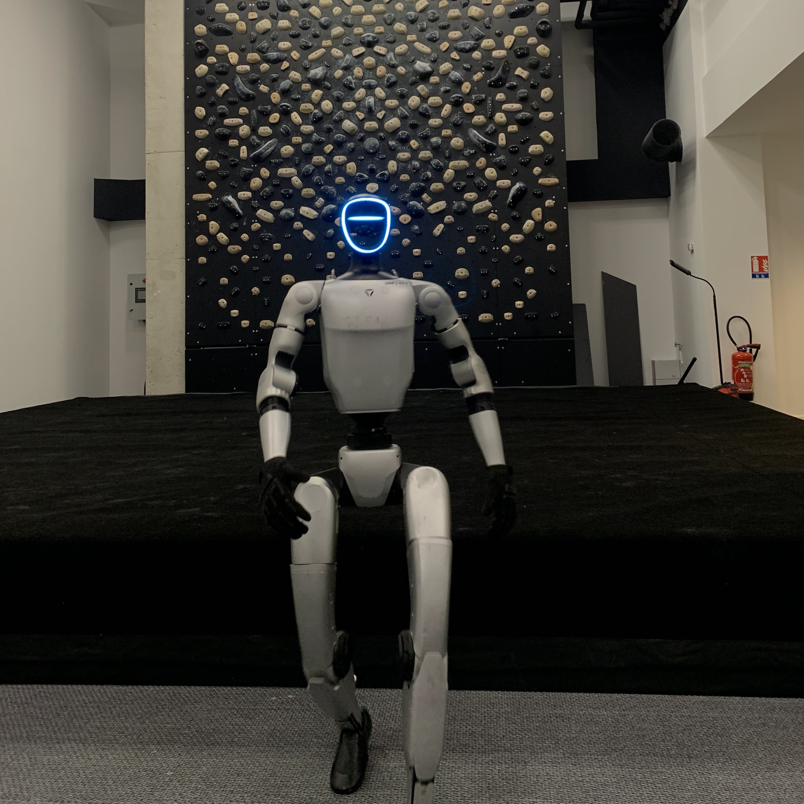

# AI 日报 | 2026-03-12

## 📌 今日总结

- **NVIDIA 发布 Code Concepts 合成数据集**：1500 万 Python 编程问题，基于概念驱动的数据生成工作流，在 Nemotron-Nano-v3 上实现 HumanEval 6 点提升（73→79）
- **LeRobot v0.5.0 重大更新**：支持 Unitree G1 人形机器人、新增 Pi0-FAST 自回归 VLA 策略、实时分块（RTC）推理优化、流式视频编码
- **Ulysses 序列并行集成至 Hugging Face 生态**：支持百万 token 上下文训练，从 Accelerate 到 Transformers Trainer 到 TRL 全面支持
- **IBM Granite 4.0 1B Speech 发布**：紧凑型多语言语音模型，支持 6 种语言，在 OpenASR 排行榜登顶
- **Modular Diffusers 推出**：可组合的扩散模型构建块，支持自定义工作流和 Mellon 可视化集成

## 📚 重要论文一览

| 标题 | 来源 | 亮点 | 链接 |
|------|------|------|------|
| Code Concepts: A Large-Scale Synthetic Dataset | NVIDIA / Hugging Face | 概念驱动合成数据生成，15M Python 问题 | [博客](https://huggingface.co/blog/nvidia/synthetic-code-concepts) |
| LeRobot v0.5.0: Scaling Every Dimension | Hugging Face | 人形机器人支持、6 种新策略、流式编码 | [博客](https://huggingface.co/blog/lerobot-release-v050) |
| Ulysses Sequence Parallelism | Snowflake / Hugging Face | 百万 token 上下文训练，DeepSpeed 后端 | [博客](https://huggingface.co/blog/ulysses-sp) |
| Granite 4.0 1B Speech | IBM | 1B 参数多语言 ASR，OpenASR #1 | [博客](https://huggingface.co/blog/ibm-granite/granite-4-speech) |
| Keep the Tokens Flowing: 16 Open-Source RL Libraries | Hugging Face | 异步 RL 训练库对比分析 | [博客](https://huggingface.co/blog/async-rl-training-landscape) |
| Introducing Modular Diffusers | Hugging Face | 可组合扩散模型构建块 | [博客](https://huggingface.co/blog/modular-diffusers) |

## 🚀 技术动态

### 1. NVIDIA Code Concepts 数据集发布
NVIDIA 发布了基于概念驱动的合成数据生成工作流，创建了包含 1500 万 Python 编程问题的 Nemotron-Pretraining-Code-Concepts 数据集。该数据集基于从 HumanEval 提示中提取的 91 个核心编程概念，通过组合和提炼选定概念实现针对性数据生成。在 Nemotron-Nano-v3 最后 100B token 预训练中加入 10B token 的 Code Concepts 数据，实现了 HumanEval 从 73 到 79 的 6 点提升。

### 2. LeRobot v0.5.0 重大更新
Hugging Face 的 LeRobot 迎来最大规模更新，包含 200+ 合并 PR 和 50+ 新贡献者。主要更新包括：
- 首次支持 Unitree G1 人形机器人（全身控制、运动、操作、遥操作）
- 新增 Pi0-FAST 自回归 VLA 策略（基于 Gemma 300M 的动作专家）
- 实时分块（RTC）推理技术，显著提升流匹配策略的响应性
- 流式视频编码，消除录制间隔等待时间
- EnvHub：直接从 Hugging Face Hub 加载仿真环境

### 3. Ulysses 序列并行全面集成
Snowflake 的 Ulysses 序列并行（ALST 协议的一部分）现已集成到 Hugging Face 整个生态系统中，包括 Accelerate、Transformers Trainer 和 TRL 的 SFTTrainer。该技术通过注意力头并行化，将注意力计算分布到多个 GPU 上，支持百万 token 上下文训练。相比 Ring Attention，Ulysses 具有更低的通信复杂度和延迟。

## 🔍 详细介绍（深度解读）

### 1. Code Concepts：概念驱动的合成数据生成

#### 研究背景与动机
在大规模 LLM 开发中，模型质量的提升不仅依赖于数据数量，更取决于数据质量和特异性。预训练数据集虽然包含海量信息，但往往缺乏针对特定技能（如推理或编程能力）的概念性目标。NVIDIA 团队设计了可扩展的概念驱动合成数据生成工作流，使研究人员能够生成与期望模型能力对齐的数据。

#### 问题定义与挑战
核心挑战在于：如何系统性地生成针对特定编程概念的高质量训练数据？传统方法依赖于爬取互联网代码，但难以控制概念分布、难度梯度和多样性。

#### 核心方法与技术细节


工作流程的核心是从大规模标注的 Nemotron-Pretraining-Code-{v1,v2} 数据集中提取的编程知识分类体系。该分类体系编码了数千个分层组织的编程概念，从基本结构（如字符串、递归）到高级算法和数据结构模式。

具体步骤：
1. **概念提取**：从 HumanEval 基准的分类提示中识别 91 个核心概念
2. **概念组合**：指导性地组合选定概念生成提示
3. **数据生成**：使用 GPT-OSS 120B 生成约 1500 万个合成 Python 编程问题
4. **质量验证**：使用 Python 的 ast.parse 函数验证生成的代码可执行


#### 实验设计与结果
将 10B token 的 Code Concepts 数据纳入 Nemotron-Nano-v3 最后 100B token 预训练中进行数据消融实验：

- **HumanEval**：从 73 提升至 79（+6 点）
- **其他基准**：大多数保持不变
- **定性评估**：在图算法、集合运算等多种编程概念上表现更强，边缘情况和执行推理处理能力改善

#### 局限性分析
- 目前仅针对 Python 编程，需要扩展到其他编程语言和领域
- 依赖强大的教师模型（GPT-OSS 120B）进行数据生成
- 概念分类体系需要人工维护和扩展

#### 未来方向与影响
该数据集验证了更广泛的概念驱动生成工作流，而非一次性产物。通过以 CC-BY-4.0 许可发布数据集和底层分类体系，团队希望社区能够将此方法扩展到其他领域和用例，实现可扩展的针对性 LLM 预训练。

#### 相关资源链接
- [Nemotron-Pretraining-Specialized-v1.1 数据集](https://huggingface.co/datasets/nvidia/Nemotron-Pretraining-Specialized-v1.1)
- [Nemotron-Nano-v3 模型](https://huggingface.co/nvidia/NVIDIA-Nemotron-3-Nano-30B-A3B-Base-BF16)
- [博客文章](https://huggingface.co/blog/nvidia/synthetic-code-concepts)

---

### 2. LeRobot v0.5.0：机器人学习的全面扩展

#### 研究背景与动机
LeRobot 是 Hugging Face 的开源机器人学习库，旨在降低机器人 AI 的研究和部署门槛。v0.5.0 是该库迄今为止最大的更新，在硬件支持、策略模型、数据集处理和仿真环境等各个维度都进行了大幅扩展。

#### 核心方法与技术细节

##### 硬件支持扩展


**Unitree G1 人形机器人**：这是 LeRobot 首次集成的人形机器人平台，支持：
- 运动：在环境中行走、导航和移动
- 操作：执行灵巧的对象操作任务
- 遥操作：通过直观的遥操作界面远程控制 G1
- 全身控制（WBC）：同时协调运动和操作以完成复杂的现实世界任务

其他新增硬件支持：
- OpenArm & OpenArm Mini（支持双臂配置）
- Earth Rover（首个移动机器人集成）
- OMX Robot（新机械臂）
- CAN 总线电机控制器支持（RobStride、Damiao）

##### 新策略模型

**Pi0-FAST 自回归 VLA**：
- 基于 FAST（频域动作序列分词）的自回归视觉 - 语言 - 动作模型
- 使用基于 Gemma 300M 的动作专家生成分散化的动作 token
- 支持可配置的温度和最大解码步数
- 与实时分块（RTC）兼容

**实时分块（RTC）**：
- 来自 Physical Intelligence 的推理时技术
- 持续混合新预测与进行中的动作，而非等待完整动作块完成
- 使流匹配策略的响应性显著提升
- 通过 `--policy.rtc_config.enabled=true` 配置

**其他新策略**：
- Wall-X：基于 Qwen2.5-VL 的 VLA，流匹配动作预测
- X-VLA：基于 Microsoft Florence-2 的 VLA
- SARM（阶段感知奖励建模）：针对长视野任务


##### 数据集优化

**流式视频编码**：
- 实时编码捕获的帧，消除录制间隔等待时间
- 支持硬件编码器自动检测
- 配置示例：
```python
dataset = LeRobotDataset.create(
    repo_id="my/dataset",
    fps=30,
    video_backend="auto",
    streaming_encoding=True,
)
```

**性能提升**：
- 图像训练速度提升 10 倍
- 编码速度提升 3 倍（并行编码为默认）
- 更好的 CPU 利用率

##### EnvHub：从 Hub 加载环境
EnvHub 允许直接从 Hugging Face Hub 加载仿真环境，无需本地安装包：
```bash
lerobot-train \
  --env.type=hub \
  --env.hub_path="username/my-custom-env" \
  --policy.type=act
```

集成 NVIDIA IsaacLab-Arena，提供 GPU 加速的仿真和大规模并行环境实例。

#### 实验设计与结果
v0.5.0 包含 200+ 合并 PR 和 50+ 新贡献者，支持：
- Python 3.12+ 和 Transformers v5
- 第三方策略插件系统
- 远程 Rerun 可视化
- 文档版本化
- PyTorch 版本更新支持 NVIDIA Blackwell GPU

#### 局限性分析
- 人形机器人控制仍处于早期阶段，需要更多研究和数据
- 某些高级策略（如 Pi0-FAST）需要较高的计算资源
- 仿真到现实的迁移仍需大量实验调优

#### 未来方向与影响
LeRobot v0.5.0 代表了开源机器人学习的重要里程碑，使人形机器人研究更加普及。通过降低硬件和策略的入门门槛，预计将加速具身智能研究的发展。

#### 相关资源链接
- [LeRobot v0.5.0 文档](https://huggingface.co/docs/lerobot)
- [Unitree G1 教程](https://huggingface.co/docs/lerobot/unitree_g1)
- [Pi0-FAST 文档](https://huggingface.co/docs/lerobot/pi0fast)
- [RTC 论文](https://huggingface.co/papers/2506.07339)
- [EnvHub 教程](https://huggingface.co/docs/lerobot/envhub)

---

### 3. Granite 4.0 1B Speech：紧凑型多语言语音模型

#### 研究背景与动机
IBM 发布了 Granite 4.0 1B Speech，专为资源受限设备上的企业应用设计。该模型在前代 granite-speech-3.3-2b 的基础上，参数量减半但性能提升，支持更多语言。

#### 核心方法与技术细节
- **参数量**：仅 1B（前代为 2B）
- **支持语言**：英语、法语、德语、西班牙语、葡萄牙语、日语
- **新功能**：日语 ASR 支持、关键词列表偏置（改善名称和首字母缩写的识别）
- **推理优化**：通过推测解码实现更快的推理

#### 实验设计与结果


在标准英语 ASR 基准上使用词错误率（WER）评估，Granite 4.0 1B Speech 在多个数据集上实现了具有竞争力的低 WER，同时参数量远少于许多可比模型。该模型最近在 OpenASR 排行榜上排名第 1。

#### 局限性分析
- 主要针对 ASR 和 AST 任务，不支持通用语音对话
- 多语言支持仍有限，未覆盖所有主要语言

#### 未来方向与影响
该模型展示了小模型在特定任务上实现 SOTA 性能的潜力，适合边缘部署和企业应用。推荐与 Granite Guardian 配对用于需要风险检测的生产部署。

#### 相关资源链接
- [模型卡片](https://huggingface.co/ibm-granite/granite-4.0-1b-speech)
- [OpenASR 排行榜](https://huggingface.co/spaces/hf-audio/open_asr_leaderboard)
- [Granite Speech 集合](https://huggingface.co/collections/ibm-granite/granite-speech)

## 💡 应用案例

### 1. 编程教育 AI 助手
Code Concepts 数据集可用于训练专门针对编程教育的 AI 助手，能够生成针对特定编程概念的练习题，帮助学生系统性地掌握编程技能。

### 2. 人形机器人家庭服务
LeRobot 对 Unitree G1 的支持使得研究者和开发者能够更容易地开发和部署家庭服务机器人应用，如物品整理、清洁辅助等。

### 3. 多语言会议转录
Granite 4.0 1B Speech 的多语言支持使其适合用于国际会议的实时转录系统，可在资源受限的边缘设备上运行。

### 4. 长文档分析系统
Ulysses 序列并行技术使得训练能够处理整本书籍、法律文档或研究论文的模型成为可能，适用于法律、学术等专业领域的文档分析。

## 📊 统计汇总

| 类别 | 项目 | 数量/指标 |
|------|------|-----------|
| 数据集 | Code Concepts Python 问题 | 15M |
| 数据集 | 核心编程概念 | 91 |
| 模型 | HumanEval 提升 | +6 点 (73→79) |
| 机器人 | LeRobot 新增支持机器人 | 5+ |
| 机器人 | LeRobot 新增策略 | 6 |
| 机器人 | LeRobot 合并 PR | 200+ |
| 机器人 | LeRobot 新贡献者 | 50+ |
| 语音 | Granite 支持语言 | 6 |
| 语音 | Granite 参数量 | 1B |
| 语音 | OpenASR 排名 | #1 |
| 训练 | Ulysses 支持上下文长度 | 百万 token |
| 训练 | 图像训练加速 | 10x |
| 训练 | 编码加速 | 3x |

## 📖 全部参考链接

1. [Code Concepts: A Large-Scale Synthetic Dataset](https://huggingface.co/blog/nvidia/synthetic-code-concepts)
2. [LeRobot v0.5.0: Scaling Every Dimension](https://huggingface.co/blog/lerobot-release-v050)
3. [Ulysses Sequence Parallelism](https://huggingface.co/blog/ulysses-sp)
4. [Granite 4.0 1B Speech](https://huggingface.co/blog/ibm-granite/granite-4-speech)
5. [Keep the Tokens Flowing: 16 Open-Source RL Libraries](https://huggingface.co/blog/async-rl-training-landscape)
6. [Introducing Modular Diffusers](https://huggingface.co/blog/modular-diffusers)
7. [Nemotron-Pretraining-Specialized-v1.1](https://huggingface.co/datasets/nvidia/Nemotron-Pretraining-Specialized-v1.1)
8. [OpenASR Leaderboard](https://huggingface.co/spaces/hf-audio/open_asr_leaderboard)
9. [RTC Paper](https://huggingface.co/papers/2506.07339)
10. [LeRobot Documentation](https://huggingface.co/docs/lerobot)

---

*Generated by AI Daily Bot | 数据来源：Hugging Face Blog, arXiv, 官方技术博客*
