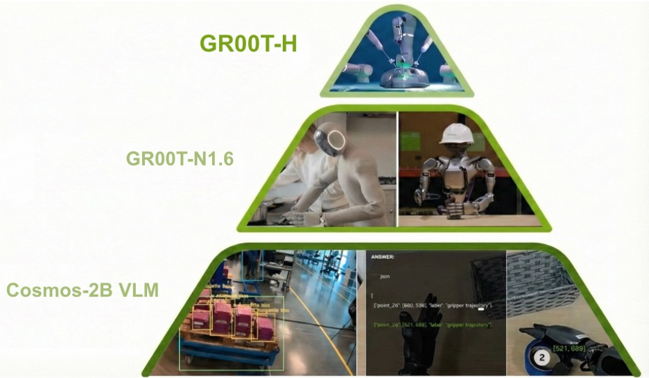

# AI 日报 | 2026-03-17

> 📅 日期：2026 年 3 月 17 日  
> 📝 编辑：AI Assistant  
> 🔖 主题：医疗机器人、人形机器人、大模型鲁棒性、长序列训练

---

## 📌 今日总结

- **NVIDIA 发布 Open-H-Embodiment**：首个医疗机器人开放数据集，包含 778 小时手术机器人数据，同步开源 GR00T-H 视觉语言动作模型和 Cosmos-H 手术模拟器
- **LeRobot v0.5.0 重大更新**：首次支持 Unitree G1 人形机器人，新增 Pi0-FAST 自回归 VLA、实时分块推理 (RTC) 等 6 项新策略，数据录制速度提升 10 倍
- **语义不变性研究揭示大模型脆弱性**：AMSTA 2026 论文发现模型规模与鲁棒性成反比，Qwen3-30B 以 79.6% 稳定性超越更大模型
- **Ulysses 序列并行集成至 Hugging Face 生态**：支持百万 token 上下文训练，4 卡可实现 96K 序列长度，吞吐量提升 3.7 倍
- **PhysMoDPO 物理合理人形运动生成**：基于 DPO 的微调框架，在 Unitree G1 上实现零样本迁移，运动平滑度和任务一致性显著提升

---

## 📚 重要论文一览

| 论文/项目 | 来源 | 亮点 | 链接 |
|-----------|------|------|------|
| Open-H-Embodiment | NVIDIA / Hugging Face | 778 小时医疗机器人数据，35 机构协作 | [HF Dataset](https://huggingface.co/datasets/nvidia/PhysicalAI-Robotics-Open-H-Embodiment) |
| GR00T-H | NVIDIA | 首个手术机器人 VLA 模型，基于 Cosmos Reason 2 2B | [HF Model](https://huggingface.co/nvidia/GR00T-H) |
| PhysMoDPO | MBZUAI / arXiv | 物理引导 DPO 微调，G1 机器人零样本迁移 | [arXiv:2603.13228](https://arxiv.org/abs/2603.13228) |
| Semantic Invariance in Agentic AI | AMSTA 2026 | 变体测试揭示大模型推理脆弱性 | [arXiv:2603.13173](https://arxiv.org/abs/2603.13173) |
| LeRobot v0.5.0 | Hugging Face | 人形机器人支持，6 项新策略，10 倍数据加速 | [Blog](https://huggingface.co/blog/lerobot-release-v050) |
| Ulysses Sequence Parallelism | Hugging Face / Snowflake | 百万 token 训练，4 卡 96K 上下文 | [Blog](https://huggingface.co/blog/ulysses-sp) |

---

## 🚀 技术动态

### 1. NVIDIA 发布医疗物理 AI 三大组件

NVIDIA 联合 35 家机构发布 **Open-H-Embodiment**，这是首个面向医疗机器人的开放数据集，包含：
- **778 小时** CC-BY-4.0 许可的医疗机器人训练数据
- 涵盖手术机器人、超声、结肠镜自主操作任务
- 支持 CMR Surgical、Rob Surgical、Tuodao 等商业机器人及 dVRK、Franka、Kuka 等研究机器人

同步开源两个模型：
- **GR00T-H**：首个手术机器人视觉语言动作 (VLA) 模型，基于 Cosmos Reason 2 2B 骨干，采用独特 embodiment 投影器和状态 dropout 技术
- **Cosmos-H-Surgical-Simulator**：世界基础模型 (WFM)，可从运动学生成物理合理的手术视频，600 次 rollout 仅需 40 分钟（传统方法需 2 天）

### 2. LeRobot v0.5.0：人形机器人时代来临

Hugging Face LeRobot 迎来最大规模更新：
- **首次支持 Unitree G1 人形机器人**：完整 locomotion、manipulation、teleoperation 和全身控制 (WBC)
- **6 项新策略**：Pi0-FAST 自回归 VLA、Real-Time Chunking (RTC)、Wall-X (Qwen2.5-VL 基础)、X-VLA (Florence2 基础)、SARM 长程任务、PEFT 微调支持
- **性能提升**：流式视频编码消除录制等待，图像训练速度提升 10 倍，编码速度提升 3 倍
- **EnvHub**：直接从 Hugging Face Hub 加载仿真环境，支持 NVIDIA IsaacLab-Arena

### 3. Ulysses 序列并行正式集成

Hugging Face 将 Snowflake 的 **Ulysses Sequence Parallelism** 集成到 Accelerate、Transformers Trainer 和 TRL SFTTrainer：
- 通过注意力头并行实现百万 token 上下文训练
- 4×H100 可训练 96K 序列（12 倍于基线），吞吐量提升 3.7 倍
- 支持 FlashAttention 2/3，兼容 DeepSpeed ZeRO-3 和 Liger-Kernel

---

## 🔍 详细介绍（深度解读）

### 一、Open-H-Embodiment：医疗机器人 Physical AI 的里程碑

#### 研究背景与动机

医疗 AI 长期以来以感知为主（如医学影像分析、病理分类），但医疗的本质是"操作"——手术、插管、超声检查都需要机器人与患者进行物理交互。现有的静态感知数据集缺乏具身性、接触动力学和闭环控制数据，无法支撑 Physical AI 的训练。

NVIDIA 联合 Johns Hopkins、TUM、CMR Surgical 等 35 家机构发起 **Open-H-Embodiment** 计划，旨在构建医疗机器人领域的开放基础数据集，推动手术机器人和超声自主操作的发展。

#### 数据集规模与组成

- **778 小时** 训练数据，CC-BY-4.0 许可
- 覆盖模拟训练、台架练习（如缝合）和真实临床手术
- 9 种机器人 embodiment，32 个数据集
- 包含同步的视觉 - 力觉 - 运动学数据，支持 sim-to-real 配对

#### GR00T-H：首个手术机器人 VLA 模型

GR00T-H 基于 NVIDIA Isaac GR00T N 系列 VLA 模型，采用 Cosmos Reason 2 2B 作为视觉语言骨干。针对手术机器人高精度要求和电缆驱动系统的特殊性，采用四项关键设计：

1. **Unique Embodiment Projectors**：每个机器人的运动学通过独立 MLP 映射到共享归一化动作空间
2. **State Dropout (100%)**：推理时丢弃本体感知输入，为每个系统学习偏置项
3. **Relative EEF Actions**：使用相对末端执行器动作空间克服运动学不一致性
4. **Metadata in Task Prompts**：器械名称和控制索引直接注入 VLM 任务提示

原型已在 SutureBot 基准测试中完成完整端到端缝合，展现长程灵巧操作能力。

#### Cosmos-H-Surgical-Simulator：世界基础模型

传统手术模拟器难以处理软组织、反射、血液和烟雾等复杂因素。Cosmos-H 从 Cosmos Predict 2.5 2B 微调而来，可直接从运动学生成物理合理的手术视频：

- **Sim-to-Real Gap 消除**：隐式学习组织形变和工具交互
- **效率提升**：600 次 rollout 仅需 40 分钟（传统台架方法需 2 天）
- **合成数据生成**：生成逼真的视频 - 动作对增强稀缺数据

微调使用 64×A100 GPU，约 10,000 GPU 小时，统一 44 维动作空间。

#### 局限性与未来方向

当前版本主要支持平坦地面上的操作，未来需要：
- 扩展到更复杂的手术场景（多器械协作、组织切割等）
- 增加 reasoning-ready 数据，支持任务意图、结果和失败模式标注
- 构建手术机器人领域的"ChatGPT 时刻"，实现可解释、可规划的自主系统

#### 相关资源

- [Open-H-Embodiment Dataset](https://huggingface.co/datasets/nvidia/PhysicalAI-Robotics-Open-H-Embodiment)
- [GR00T-H Model](https://huggingface.co/nvidia/GR00T-H)
- [Cosmos-H-Surgical-Simulator](https://huggingface.co/nvidia/Cosmos-H-Surgical-Simulator)
- [Cosmos Cookbook](https://nvidia-cosmos.github.io/cosmos-cookbook/recipes/post_training/predict2_5/surgical_robotics/post_training.html)

---

### 二、LeRobot v0.5.0：人形机器人与 VLA 策略的爆发

#### 硬件支持：首次拥抱人形机器人

LeRobot v0.5.0 最大的硬件亮点是完整支持 **Unitree G1 人形机器人**：
- **Locomotion**：行走、导航、穿越环境
- **Manipulation**：灵巧物体操作
- **Teleoperation**：直观遥操作接口
- **Whole-Body Control (WBC)**：协调 locomotion 和 manipulation，实现复杂现实任务

此外还新增 OpenArm、Earth Rover（首个移动机器人）、OMX Robot 等支持，统一 SO-100/SO-101 代码库，并引入 CAN Bus 电机控制器支持（RobStride、Damiao）。

#### 策略动物园：6 项新技术

**1. Pi0-FAST：自回归 VLA**

基于 FAST（Frequency-space Action Sequence Tokenization）的自回归 VLA，使用 Gemma 300M 作为动作专家：
- 动作离散化为 token，支持自回归解码
- 可配置 temperature 和最大解码步数平衡速度与质量
- 兼容 Real-Time Chunking (RTC)

**2. Real-Time Chunking (RTC)**

来自 Physical Intelligence 的推理时技术，使 flow-matching 策略响应更快速：
- 持续混合新预测与进行中的动作，无需等待完整动作块
- 产生更平滑、更反应灵敏的行为
- 通过 `--policy.rtc_config.enabled=true` 启用

**3. Wall-X：Qwen2.5-VL 基础 VLA**

基于 Qwen2.5-VL 的 flow-matching 动作预测 VLA，支持跨 embodiment 机器人控制。

**4. X-VLA：Florence2 基础 VLA**

微软 Florence-2 视觉语言模型作为骨干，为机器人学习提供多样化基础模型选择。

**5. SARM：长程任务奖励建模**

SARM (Stage-Aware Reward Modeling) 解决长程任务学习难题：
- 预测任务阶段和阶段内进度，而非单一全局线性进度信号
- 使复杂多步操作任务训练更容易

**6. PEFT 支持**

使用 LoRA 等 PEFT 方法微调大型 VLA，无需修改核心训练流程。

#### 数据集加速：10 倍训练速度

- **流式视频编码**：实时编码帧，消除录制后等待时间
- **10 倍图像训练加速**：修复数据访问瓶颈，改进图像变换支持
- **3 倍编码加速**：并行编码成为默认，动态压缩级别自适应

#### 代码库现代化

- Python 3.12+ 最低要求
- Transformers v5 迁移
- 第三方策略插件系统
- 远程 Rerun 可视化
- 文档版本化

#### 相关资源

- [LeRobot GitHub](https://github.com/huggingface/lerobot)
- [v0.5.0 Release Blog](https://huggingface.co/blog/lerobot-release-v050)
- [ICLR 2026 Paper](https://openreview.net/forum?id=CiZMMAFQR3)

---

### 三、语义不变性研究：大模型规模≠鲁棒性

#### 研究背景

大语言模型正成为自主推理代理的核心，部署于教育评估、科学发现、医疗决策支持等高风险场景。然而，标准基准（MMLU、GSM8K、MATH）仅在固定规范问题上评估准确性，无法捕捉**语义不变性**——即模型在语义等价输入变化下保持推理稳定的能力。

#### 问题定义与挑战

物理问题无论用学术语言还是商业术语表述，无论事实顺序如何排列，无论是否添加澄清上下文，都应得到相同解答。但研究表明 LLM 对表面输入扰动异常敏感，这削弱了现实部署的可靠性。

#### 核心方法：变体测试框架

研究提出包含 8 种语义保持变换的变体测试框架：

**结构变换**：
- Identity（恒等）：基线方差
- Paraphrase（改写）：词汇句法变化
- Reorder Facts（事实重排）：独立事实顺序置换

**冗长度变换**：
- Expand（扩展）：添加澄清上下文
- Contract（收缩）：移除冗余材料

**上下文变换**：
- Academic Context（学术框架）
- Business Context（商业框架）
- Contrastive（对比）：添加替代场景对比（压力测试）

#### 实验设计

评估 7 个基础模型（4 个架构家族）：
- Hermes (70B, 405B)
- Qwen3 (30B-A3B, 235B-A22B)
- DeepSeek-R1-0528
- gpt-oss (20B, 120B)

19 个多步推理问题，8 个科学领域（物理、数学、化学、经济、统计、生物、微积分、优化），3 个难度级别。

#### 关键发现

**发现 1：规模 - 鲁棒性反转**

| 模型 | 分数 | MAD↓ | 稳定性↑ | 语义相似度↑ |
|------|------|------|---------|-------------|
| Hermes-4-70B | 0.667 | 0.086 | 50.7% | 0.832 |
| Hermes-4-405B | 0.618 | 0.109 | 67.1% | 0.878 |
| Qwen3-235B-A22B | 0.529 | 0.072 | 69.7% | 0.891 |
| **Qwen3-30B-A3B** | 0.514 | **0.049** | **79.6%** | **0.914** |
| DeepSeek-R1-0528 | 0.470 | 0.107 | 67.1% | 0.783 |
| gpt-oss-20b | 0.445 | 0.211 | 27.0% | 0.527 |
| gpt-oss-120b | 0.441 | 0.143 | 64.5% | 0.772 |

**Qwen3-30B-A3B**（仅 3B 激活参数）实现最佳鲁棒性：最低 MAD (0.049)、最高稳定性 (79.6%)、最高语义相似度 (0.914)。更大模型反而更脆弱。

**发现 2：架构家族特征脆弱性**

- **Hermes**：基线性能强，但对对比变换脆弱（Δ=-0.126~-0.208）
- **Qwen3**：最均衡鲁棒性剖面，所有 MR 平均 |Δ|<0.05
- **DeepSeek-R1**：对结构变换敏感，尤其 reorder_facts (Δ=-0.171)
- **gpt-oss**：灾难性不稳定，对比变换下 Δ=-0.449

**发现 3：普遍对比脆弱性**

对比变换是唯一普遍降低所有模型性能的 MR，平均 Δ 从 -0.088 (Qwen3-30B) 到 -0.449 (gpt-oss-120b)。这表明注意力机制在处理干扰信息时存在根本局限。

#### 局限性与未来方向

- 19 个问题虽多样但仍是子集
- 单次推理协议未捕捉完整行为分布
- LLM 辅助变换可能存在风格偏差

未来工作：
- 开发鲁棒性感知微调目标
- 设计利用互补脆弱性的集成架构
- 扩展到多代理协作推理场景

#### 相关资源

- [arXiv:2603.13173](https://arxiv.org/abs/2603.13173)
- [AMSTA 2026 (即将发表)](https://www.kesinternational.org/amsta/)

---

### 四、PhysMoDPO：物理合理人形运动生成

#### 研究背景

扩散模型推动了文本驱动运动生成的进展，但部署到人形机器人时面临关键限制：扩散模型在运动学空间训练评估，而机器人需要满足动力学和接触约束的运动（脚不滑动、质心受支撑）。

#### 核心方法

PhysMoDPO 提出物理引导的后训练框架：
1. 对每个条件，随机采样 K 个候选运动
2. 通过预训练 WBC (DeepMimic) 执行每个候选，获得仿真轨迹
3. 计算物理奖励（可跟踪性、接触真实感）和任务奖励（条件忠实度）
4. 构建偏好对，使用 DPO 微调生成器

**奖励设计**：
- **ℛ_track**：最小化生成运动与仿真轨迹差异
- **ℛ_slide**：惩罚脚部微滑动
- **ℛ_M2T**：TMR 文本 - 运动一致性
- **ℛ_control**：空间控制任务的目标匹配

#### 实验结果

**SMPL 仿真角色（HumanML3D）**：

| 方法 | M2T↑ | R@1↑ | R@3↑ | FID↓ | Jerk↓ |
|------|------|------|------|------|-------|
| MaskedMimic | 19.73 | 0.4134 | 0.6305 | 73.79 | 66.08 |
| MotionStreamer | 17.17 | 0.5829 | 0.8310 | 49.14 | 46.75 |
| **PhysMoDPO** | **16.95** | **0.5853** | **0.8517** | **48.29** | **43.60** |

**Unitree G1 零样本迁移**：

| 方法 | M2T↑ | R@1↑ | R@3↑ | FID↓ | Jerk↓ |
|------|------|------|------|------|-------|
| MaskedMimic | 0.7156 | 0.3258 | 0.5761 | 0.3673 | 83.58 |
| MotionStreamer | 0.7904 | 0.4673 | 0.7558 | 0.3033 | 95.08 |
| **PhysMoDPO** | **0.7919** | **0.4707** | **0.7640** | **0.3029** | 90.14 |

PhysMoDPO 在文本一致性、物理真实感和运动平滑度上均取得提升，且能零样本迁移到 G1 机器人。

#### 局限性与未来方向

- 当前主要支持平坦地面 locomotion
- 偏好对构建依赖固定仿真跟踪策略，可能引入偏差
- 未来可扩展到多样地形、融入人工验证模型

#### 相关资源

- [arXiv:2603.13228](https://arxiv.org/abs/2603.13228)
- [Project Page](https://mael-zys.github.io/PhysMoDPO/)

---

## 💡 应用案例

### 1. 手术机器人自主缝合

GR00T-H 已在 SutureBot 基准测试中完成端到端缝合操作，展示了长程灵巧操作能力。未来可应用于：
- 微创手术自动化
- 远程手术辅助
- 手术培训模拟

### 2. 人形机器人家庭服务

LeRobot v0.5.0 的 G1 支持使家庭服务机器人开发门槛大幅降低：
- 物体抓取与操作
- 导航与避障
- 人机交互

### 3. 长文档理解与分析

Ulysses 序列并行使百万 token 上下文训练成为现实：
- 整本书籍分析
- 法律合同审查
- 代码库理解
- 多文档 RAG 系统

### 4. 高可靠性 AI 代理

语义不变性研究为高风险场景的模型选择提供指导：
- 医疗诊断支持选择鲁棒性高的模型（如 Qwen3-30B）
- 金融决策系统避免对比脆弱性
- 教育评估确保问题表述不影响结果

---

## 📊 统计汇总

| 类别 | 数量/规模 | 关键指标 |
|------|-----------|----------|
| Open-H-Embodiment 数据 | 778 小时 | 35 机构，9 embodiment，32 数据集 |
| GR00T-H 训练 | ~600 小时数据 | Cosmos Reason 2 2B 骨干 |
| Cosmos-H 微调 | 64×A100, 10K GPU 小时 | 44 维动作空间 |
| LeRobot v0.5.0 | 200+ PR, 50+ 贡献者 | 6 新策略，10 倍训练加速 |
| 语义不变性评估 | 7 模型，19 问题，8 领域 | Qwen3-30B 79.6% 稳定性 |
| Ulysses SP | 4×H100 | 96K 序列，3.7 倍吞吐 |
| PhysMoDPO | SMPL→G1 零样本 | R@3 提升 2.5%，Jerk 降低 6.8% |

---

## 📖 全部参考链接

### 数据集与模型
- [Open-H-Embodiment Dataset](https://huggingface.co/datasets/nvidia/PhysicalAI-Robotics-Open-H-Embodiment)
- [GR00T-H Model](https://huggingface.co/nvidia/GR00T-H)
- [Cosmos-H-Surgical-Simulator](https://huggingface.co/nvidia/Cosmos-H-Surgical-Simulator)

### 论文
- [Semantic Invariance in Agentic AI (arXiv:2603.13173)](https://arxiv.org/abs/2603.13173)
- [PhysMoDPO (arXiv:2603.13228)](https://arxiv.org/abs/2603.13228)
- [Arctic Long Sequence Training (arXiv:2506.13996)](https://huggingface.co/papers/2506.13996)
- [DeepSpeed Ulysses (arXiv:2309.14509)](https://huggingface.co/papers/2309.14509)

### 博客与文档
- [NVIDIA Physical AI for Healthcare Robotics](https://huggingface.co/blog/nvidia/physical-ai-for-healthcare-robotics)
- [LeRobot v0.5.0 Release](https://huggingface.co/blog/lerobot-release-v050)
- [Ulysses Sequence Parallelism](https://huggingface.co/blog/ulysses-sp)
- [LeRobot GitHub](https://github.com/huggingface/lerobot)
- [PhysMoDPO Project Page](https://mael-zys.github.io/PhysMoDPO/)

### 工具与教程
- [Cosmos Cookbook](https://nvidia-cosmos.github.io/cosmos-cookbook/)
- [Accelerate Sequence Parallelism Guide](https://huggingface.co/docs/accelerate/concept_guides/sequence_parallelism)
- [TRL Distributing Training](https://huggingface.co/docs/trl/distributing_training)

---

*Generated by AI Assistant | 数据来源：arXiv, Hugging Face Blog, NVIDIA Blog | 更新时间：2026-03-17 00:00 UTC*
