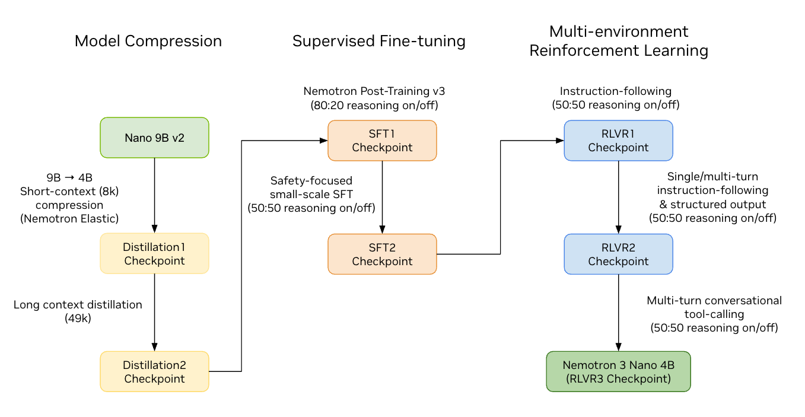
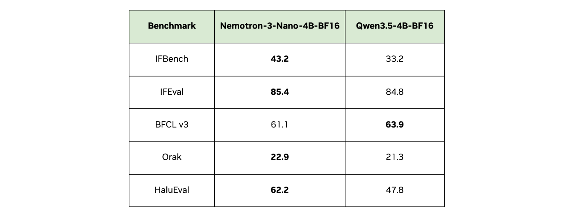

# AI 日报 | 2026-03-18

## 📌 今日总结

- **NVIDIA 发布 Nemotron 3 Nano 4B**：采用混合 Mamba-Transformer 架构的紧凑型模型，仅 4B 参数即可在边缘设备运行，在指令遵循和游戏智能方面达到同尺寸 SOTA
- **Holotron-12B 电脑使用智能体**：基于 Nemotron 架构的多模态智能体，WebVoyager 基准测试达 80.5%，吞吐量比 Holo2-8B 提升 2 倍以上
- **OpenSeeker 开源搜索智能体**：首个完全开源的训练数据和模型，仅用 11.7k 合成样本就在 BrowseComp 上达到 29.5%，超越多个工业级模型
- **LeRobot v0.5.0 重大更新**：新增 Unitree G1 人形机器人支持、Pi0-FAST 自回归 VLA、实时分块推理等 6 项新策略
- **Ulysses 序列并行训练**：Hugging Face 生态全面集成，支持百万 token 上下文训练，通信开销比 Ring Attention 低一个数量级

## 📚 重要论文一览

| 论文/项目 | 来源 | 亮点 | 链接 |
|-----------|------|------|------|
| Nemotron 3 Nano 4B | NVIDIA | 4B 混合架构模型，边缘部署优化 | [HF](https://huggingface.co/nvidia/NVIDIA-Nemotron-3-Nano-4B-BF16) |
| Holotron-12B | H Company | 高吞吐量电脑使用智能体，WebVoyager 80.5% | [HF Blog](https://huggingface.co/blog/Hcompany/holotron-12b) |
| OpenSeeker | 上海交大 | 完全开源搜索智能体，数据 + 模型全公开 | [arXiv:2603.15594](https://arxiv.org/abs/2603.15594) |
| LeRobot v0.5.0 | Hugging Face | 人形机器人支持，6 项新策略，10 倍训练加速 | [HF Blog](https://huggingface.co/blog/lerobot-release-v050) |
| Ulysses SP | Snowflake/HF | 百万 token 上下文训练，序列并行集成 | [HF Blog](https://huggingface.co/blog/ulysses-sp) |
| 反事实解释指标研究 | 比勒菲尔德大学 | 算法指标与人类感知相关性弱 | [arXiv:2603.15607](https://arxiv.org/abs/2603.15607) |

## 🚀 技术动态

### 1. NVIDIA Nemotron 3 Nano 4B：边缘 AI 新标准

NVIDIA 发布了 Nemotron 3 家族中最紧凑的成员——**Nemotron 3 Nano 4B**。这款仅 40 亿参数的模型采用混合 Mamba-Transformer 架构，专为边缘设备优化：

- **指令遵循**：在 IFBench 和 IFEval 基准上达到同尺寸 SOTA
- **游戏智能**：在 Orak 基准（Super Mario、Darkest Dungeon、Stardew Valley）上表现最佳
- **VRAM 效率**：在低/高 ISL/OSL 设置下 VRAM 占用最低
- **延迟优化**：高 ISL 设置下 TTFT（首 token 时间）最低

模型通过 **Nemotron Elastic** 框架从 9B 版本剪枝蒸馏而来，支持 FP8 和 Q4_K_M GGUF 量化，在 Jetson Orin Nano 上可达 18 tokens/s。

### 2. LeRobot v0.5.0：机器人学习生态大扩张

Hugging Face LeRobot 迎来迄今为止最大更新，超过 200 个 PR 和 50 位新贡献者：

- **首个人形机器人支持**：完整集成 Unitree G1，支持 locomotion、manipulation、teleoperation 和全身控制
- **6 项新策略**：Pi0-FAST 自回归 VLA、实时分块 (RTC)、Wall-X、X-VLA、SARM、PEFT 支持
- **性能提升**：流式视频编码消除录制等待，图像训练速度提升 10 倍，编码速度提升 3 倍
- **EnvHub**：直接从 Hugging Face Hub 加载仿真环境，支持 NVIDIA IsaacLab-Arena

### 3. OpenSeeker：民主化前沿搜索智能体

上海交通大学团队发布了首个**完全开源**的搜索智能体，包括模型和全部训练数据：

- **BrowseComp 29.5%**：显著超越第二好的开源智能体 DeepDive (15.3%)
- **BrowseComp-ZH 48.4%**：超越阿里巴巴通义千问 DeepResearch (46.7%)
- **仅 11.7k 合成样本**：通过事实基础的 QA 合成和去噪轨迹合成实现
- **完全开源**：合成方案、训练数据（QA 对和完整轨迹）、模型权重全部公开

## 🔍 详细介绍（深度解读）

### 一、Nemotron 3 Nano 4B：混合架构的边缘 AI 突破

#### 研究背景与动机

随着大模型在边缘设备部署需求的增长，如何在有限 VRAM 和计算资源下保持高性能成为关键挑战。NVIDIA Nemotron 3 Nano 4B 旨在为 GeForce RTX、Jetson 和 DGX Spark 等设备提供本地对话代理和角色支持，实现更快响应、增强数据隐私和灵活部署。

#### 核心方法与技术细节

**1. Nemotron Elastic 压缩框架**

Nemotron 3 Nano 4B 通过 Nemotron Elastic 框架从 Nemotron Nano 9B v2 压缩而来。与传统剪枝方法不同，Nemotron Elastic 使用端到端训练的路由器进行神经架构搜索：

- **路由器决策的剪枝轴**：
  - Mamba heads：从 128 减少到 96
  - 隐藏维度：从 4480 缩减到 3136
  - FFN 通道：从 15680 剪枝到 12544
  - 深度：从 56 层减少到 42 层（21 Mamba + 4 Attention + 17 MLP）

- **联合训练策略**：路由器与模型联合训练，使用辅助损失（针对学生模型尺寸）和原始知识蒸馏损失

**2. 两阶段蒸馏精度恢复**

- **阶段 1（短上下文 8K）**：使用 63B token 训练，数据包含 70% 后训练数据和 30% 预训练数据
- **阶段 2（长上下文 49K）**：扩展上下文到 49K token，训练 150B token 恢复长链推理能力

**3. 多环境强化学习**

通过 NeMo-RL 进行三阶段 RL 训练：
1. 单轮指令遵循数据
2. NeMo-Gym 环境（单轮/多轮指令遵循、结构化输出）
3. 多轮对话工具调用（Nemotron-RL-Agentic-Conversational-Tool-Use-Pivot-v1）

#### 实验设计与结果

**关键性能指标**：

| 基准 | Nemotron 3 Nano 4B | 同尺寸最佳竞品 |
|------|-------------------|---------------|
| IFBench | SOTA | - |
| IFEval | SOTA | - |
| Orak（游戏智能） | SOTA | - |
| VRAM 占用 | 最低 | - |
| TTFT（高 ISL） | 最低 | - |

**量化效率**：
- FP8 量化：在 DGX Spark 和 Jetson Thor 上延迟和吞吐量提升 1.8 倍，精度恢复 100%
- Q4_K_M GGUF：在 Jetson Orin Nano 8GB 上达 18 tokens/s，比 9B v2 快 2 倍

#### 局限性分析

1. **参数量限制**：4B 参数虽然适合边缘部署，但在复杂推理任务上仍不如更大模型
2. **领域特定优化**：针对游戏智能和指令遵循优化，通用知识可能不如通用大模型
3. **硬件依赖**：FP8 量化需要 NVIDIA GPU 支持，GGUF 版本虽更通用但性能略低

#### 未来方向与影响

Nemotron 3 Nano 4B 为边缘 AI 树立了新标准，预计将推动：
- 本地游戏 NPC 智能化
- 嵌入式机器人对话系统
- 隐私敏感的边缘推理应用
- 低成本大规模部署的 AI 助手

#### 相关链接

- [Hugging Face 模型页面](https://huggingface.co/nvidia/NVIDIA-Nemotron-3-Nano-4B-BF16)
- [Nemotron Elastic 论文](https://arxiv.org/abs/2511.16664)
- [Jetson AI Lab 部署指南](https://www.jetson-ai-lab.com/models/)
- [NVIGI SDK](https://developer.nvidia.com/rtx/in-game-inferencing)

---

### 二、Holotron-12B：高吞吐量电脑使用智能体

#### 研究背景与动机

当前多模态模型主要优化静态视觉或指令遵循，但电脑使用智能体需要在交互环境中高效感知、决策和行动。Holotron-12B 旨在作为生产级电脑使用智能体的策略模型，处理长上下文、多图像场景，同时在智能体基准上保持高性能。

#### 核心方法与技术细节

**1. 混合 SSM 架构的高吞吐量推理**

Holotron-12B 基于 NVIDIA Nemotron-Nano-12B-v2-VL 架构，采用混合状态空间模型 (SSM) 和注意力机制：

- **SSM 优势**：与纯 Transformer 相比，SSM 是线性循环模型，每层每序列仅存储常量状态，不随序列长度增长
- **KV Cache 优化**：传统注意力需要为每个 token 和层存储 K 和 V 激活，而 SSM 避免了这一开销
- **长上下文扩展性**：避免了全注意力机制的二次计算成本，特别适合多图像和长交互历史的智能体工作负载

**2. 训练策略**

两阶段训练：
1. **监督微调**：在 H Company 专有的定位和导航数据混合上训练，聚焦屏幕理解、grounding 和 UI 级交互
2. **训练规模**：最终 checkpoint 在约 140 亿 token 上训练

#### 实验设计与结果

**WebVoyager 基准测试**：

在真实世界多模态智能体工作负载下评估（长上下文、多高分辨率图像、100 并发请求）：

| 模型 | GPU | 吞吐量 (tokens/s) | WebVoyager |
|------|-----|------------------|------------|
| Holotron-12B | 1x H100 | 8.9k (并发 100) | 80.5% |
| Holo2-8B | 1x H100 | 5.1k (平台期) | <80.5% |
| Nemotron 基础 | - | - | 35.1% |

**关键发现**：
- Holotron-12B 吞吐量比 Holo2-8B 高 2 倍以上
- 随并发增加持续扩展，而 Holo2-8B 快速达到平台期
- 更有效的 VRAM 利用和更小内存占用，允许在相同硬件上实现更大的有效批量大小

**定位基准**：

在 OS-World-G、GroundUI 和 WebClick 等定位和 grounding 基准上显著优于基础 Nemotron 模型。

#### 局限性分析

1. **分辨率限制**：当前版本在高分辨率视觉训练方面仍有提升空间
2. **领域特定**：主要针对电脑使用场景优化，通用多模态能力可能不如专用模型
3. **依赖 NVIDIA 生态**：最佳性能需要 vLLM 和 NVIDIA GPU 支持

#### 未来方向与影响

H Company 计划基于 Nemotron 3 Omni 继续开发下一代多模态模型，目标：
- 利用增强的混合 SSM-Attention 和 MoE 架构
- 提升推理能力和多模态精度
- 推动 Holotron 从研究走向商业应用
- 为企业级大规模自主"电脑使用"部署提供高吞吐、低延迟性能

#### 相关链接

- [Hugging Face 博客](https://huggingface.co/blog/Hcompany/holotron-12b)
- [Holotron-12B 模型页面](https://huggingface.co/Hcompany/Holotron-12B)
- [NVIDIA Nemotron 3 Omni 公告](https://nvidia.com/)

---

### 三、OpenSeeker：完全开源的前沿搜索智能体

#### 研究背景与动机

深度搜索能力已成为前沿大模型智能体的必备能力，但高性能搜索智能体的开发因缺乏透明、高质量的训练数据而被工业巨头垄断。现有开源工作要么只开源模型不开源数据，要么只提供部分数据，要么性能不具竞争力。

OpenSeeker 旨在填补这一空白，成为首个**完全开源**（模型 + 数据）且达到前沿性能的搜索智能体。

#### 核心方法与技术细节

**1. 事实基础的可扩展可控 QA 合成**

核心思想是"逆向工程"推理图：

- **图扩展**：从种子节点出发，通过遍历超链接收集 k 个连接节点，形成局部依赖子图
- **实体提取**：从子图中提取与主题相关的关键实体，组织成实体子图，去除文本噪声
- **问题生成**：基于实体子图结构生成初始问题，强制要求遍历多条边才能求解
- **实体模糊化**：将具体实体映射为模糊描述，模拟真实用户歧义，防止智能体通过关键词捷径求解

**2. 去噪轨迹合成**

- **动态上下文去噪**：在生成过程中，使用辅助 LLM 总结先前的工具响应，为教师 LLM 提供更清晰的上下文
- **训练时解耦**：监督模型预测专家决策，但条件于原始、嘈杂的历史轨迹，使智能体内在学会"透过噪声看信号"

**3. 双重标准验证**

通过拒绝采样确保合成数据质量：
- **难度标准**：基础模型在闭卷设置下无法正确回答（确保需要外部信息检索）
- **可解性标准**：强教师模型能够成功求解（确保逻辑一致性）

#### 实验设计与结果

**基准测试性能**：

| 基准 | OpenSeeker | DeepDive | 通义 DeepResearch | 其他工业模型 |
|------|------------|----------|------------------|-------------|
| BrowseComp | 29.5% | 15.3% | - | 20-25% |
| BrowseComp-ZH | 48.4% | - | 46.7% | 40-45% |
| xbench-DeepSearch | 74.0% | - | - | - |
| WideSearch (item F1) | 59.4% | - | - | - |

**关键发现**：
- 仅用 11.7k 合成样本（10.3k 英文 + 1.4k 中文）和简单 SFT
- 单次训练运行，默认超参数，无启发式过滤或调优
- 在 BrowseComp-ZH 上超越阿里巴巴通义千问 DeepResearch（后者经过持续预训练、SFT 和 RL）

#### 局限性分析

1. **训练规模**：仅使用 SFT，未进行 RL 优化，性能仍有提升空间
2. **资源限制**：结果在单次训练中取得，未进行迭代优化
3. **语言覆盖**：中文样本较少（1.4k vs 10.3k 英文），可能影响多语言能力

#### 未来方向与影响

OpenSeeker 的完全开源策略将：
- 降低搜索智能体研究门槛
- 促进学术界和开源社区的协作创新
- 为后续研究提供高质量基线和数据
- 推动更透明、健康的智能体开发生态

#### 相关链接

- [arXiv 论文](https://arxiv.org/abs/2603.15594)
- [HTML 版本](https://arxiv.org/html/2603.15594v1)
- [GitHub 仓库](https://github.com/OpenSeeker/OpenSeeker)（待确认）

---

## 💡 应用案例

### 1. 边缘游戏 NPC 智能对话

Nemotron 3 Nano 4B 的 Orak 基准优化使其成为游戏 NPC 的理想选择：
- 在 RTX 4070 上本地运行，无需云端依赖
- 低延迟响应，提升玩家沉浸感
- NVIGI SDK 支持与图形工作负载并行推理

### 2. 大规模电脑使用自动化

Holotron-12B 的高吞吐量特性适合：
- 数据生成和标注流水线
- 在线强化学习环境
- 企业级 RPA 自动化
- 软件测试和 QA 自动化

### 3. 人形机器人全身控制

LeRobot v0.5.0 的 Unitree G1 支持开启新应用场景：
- 移动操作任务（边行走边抓取）
- 复杂环境导航和交互
- 遥操作训练和数据采集
- 具身智能研究

### 4. 开源搜索智能体定制

OpenSeeker 的完全开源特性使研究者可以：
- 针对特定领域微调搜索策略
- 研究和改进数据合成方法
- 开发新的搜索基准和评估方法
- 构建透明、可审计的搜索系统

## 📊 统计汇总

| 类别 | 项目数量 | 关键指标 | 开源情况 |
|------|---------|---------|---------|
| 大模型 | 2 | Nemotron 3 Nano 4B (4B), Holotron-12B (12B) | 权重开源 |
| 搜索智能体 | 1 | OpenSeeker (BrowseComp 29.5%) | 完全开源 |
| 机器人框架 | 1 | LeRobot v0.5.0 (6 项新策略) | 完全开源 |
| 训练技术 | 1 | Ulysses SP (百万 token 上下文) | 完全开源 |
| XAI 研究 | 1 | 反事实解释指标研究 | 论文公开 |

### 性能对比表

| 模型/方法 | 参数量 | 关键基准 | 性能 | 硬件需求 |
|-----------|-------|---------|------|---------|
| Nemotron 3 Nano 4B | 4B | IFBench/IFEval | SOTA | RTX 4070/Jetson |
| Holotron-12B | 12B | WebVoyager | 80.5% | 1x H100 |
| OpenSeeker | 30B (Qwen3) | BrowseComp | 29.5% | 通用 GPU |
| Holo2-8B | 8B | WebVoyager | <80.5% | 1x H100 |

## 📖 全部参考链接

### 论文与博客

1. [Nemotron 3 Nano 4B - Hugging Face Blog](https://huggingface.co/blog/nvidia/nemotron-3-nano-4b)
2. [Holotron-12B - Hugging Face Blog](https://huggingface.co/blog/Hcompany/holotron-12b)
3. [OpenSeeker - arXiv:2603.15594](https://arxiv.org/abs/2603.15594)
4. [LeRobot v0.5.0 - Hugging Face Blog](https://huggingface.co/blog/lerobot-release-v050)
5. [Ulysses Sequence Parallelism - Hugging Face Blog](https://huggingface.co/blog/ulysses-sp)
6. [Do Metrics for Counterfactual Explanations Align with User Perception? - arXiv:2603.15607](https://arxiv.org/abs/2603.15607)

### 模型与代码

1. [NVIDIA-Nemotron-3-Nano-4B-BF16](https://huggingface.co/nvidia/NVIDIA-Nemotron-3-Nano-4B-BF16)
2. [NVIDIA-Nemotron-3-Nano-4B-FP8](https://huggingface.co/nvidia/NVIDIA-Nemotron-3-Nano-4B-FP8)
3. [NVIDIA-Nemotron-3-Nano-4B-GGUF](https://huggingface.co/nvidia/NVIDIA-Nemotron-3-Nano-4B-GGUF)
4. [Holotron-12B](https://huggingface.co/Hcompany/Holotron-12B)
5. [LeRobot v0.5.0 Documentation](https://huggingface.co/docs/lerobot)

### 相关资源

1. [Nemotron Elastic Paper - arXiv:2511.16664](https://arxiv.org/abs/2511.16664)
2. [Jetson AI Lab](https://www.jetson-ai-lab.com/models/)
3. [NVIGI SDK](https://developer.nvidia.com/rtx/in-game-inferencing)
4. [NeMo-RL](https://github.com/NVIDIA-NeMo/RL)
5. [NeMo-Gym](https://github.com/NVIDIA-NeMo/Gym/)

---

*生成时间：2026-03-18 00:00 UTC*
*数据来源：arXiv, Hugging Face Blog, NVIDIA Research*
