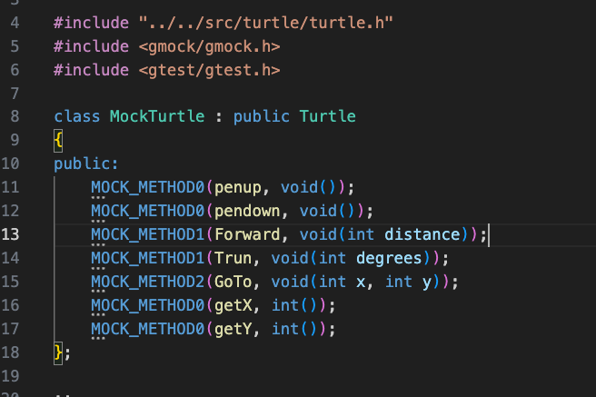

+++
date = '2025-02-09T22:07:19+08:00'
draft = true
title = 'Cpp'

+++

# Cpp Note

## CMake 使用方法

### 打印详细信息

``` she
make VERBOSE=1
```


## GTest 使用方法

### GMock

#### MOCK_METHOD

MOCK_METHOD#1(#2,#3(#4))

- #1：要mock的方法共有几个参数
- #2：要mock的方法名称
- #3:这个方法的返回值类型
- #4:这个方法的具体参数



