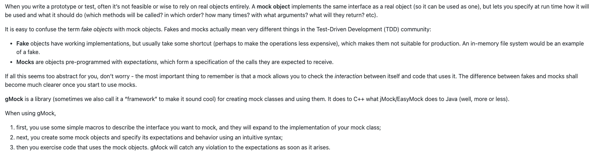

+++
date = '2025-02-09T22:07:19+08:00'
draft = true
title = 'Cpp'

+++

# Cpp Note

## CMake 使用方法

### 打印详细信息

``` she
make VERBOSE=1
```


## GTest 使用方法

[gtest官方文档](https://google.github.io/googletest/gmock_for_dummies.html)

### GTest


### GMock

模拟对象是预先编程的对象，这些对象构成了它们预期接收调用的规范



### 原始接口

``` cpp
#ifndef _TRUTLE_H_
#define _TRUTLE_H_

class Turtle {
public:
    Turtle() {}

    // 控制turtle运动是否留下痕迹
    virtual void penup() = 0;
    virtual void pendown() = 0;
    // 控制turtle的运动方向
    virtual void Forward(int distance) = 0; // 前进
    virtual void Trun(int degrees) = 0; // 转向
    virtual void GoTo(int x, int y) = 0; // 移动到指定位置

    // 获取turtle的位置
    virtual int getX() = 0;
    virtual int getY() = 0;

    virtual ~Turtle() {}

};

#endif
```

#### MOCK_METHOD

MOCK_METHOD#1(#2,#3(#4))

- #1：要mock的方法共有几个参数
- #2：要mock的方法名称
- #3:这个方法的返回值类型
- #4:这个方法的具体参数

``` cpp
#ifndef _MOCK_TURTLE_H_
#define _MOCK_TURTLE_H_

#include "../../src/turtle/turtle.h"
#include <gmock/gmock.h>
#include <gtest/gtest.h>

class MockTurtle : public Turtle
{
public:
    MockTurtle() {}
    ~MockTurtle() {}

    MOCK_METHOD0(penup, void());
    MOCK_METHOD0(pendown, void());
    MOCK_METHOD1(Forward, void(int distance));
    MOCK_METHOD1(Trun, void(int degrees));
    MOCK_METHOD2(GoTo, void(int x, int y));
    MOCK_METHOD0(getX, int());
    MOCK_METHOD0(getY, int());
};

#endif
```

### 如何使用

#### EXPECT_CALL

``` cpp
EXPECT_CALL(mock_object, method(matchers))
  		.Times(cardinality)
  		.WillOnce(action)
  		.WillRepeatedly(action)
```

``` cpp
#include "test_turtle.h"
#include "MockTurtle.h"
#include "../../src/turtle/Painter.h"

#include <gtest/gtest.h>
#include <gmock/gmock.h>

// 从命名空间testing导入gmock名称
using ::testing::AtLeast;
using ::testing::Return;

TEST(PainterTest, DrawCircleTest)
{
    // 创建mock对象
    MockTurtle turtle;
    // atleast(1)表示至少调用一次
    EXPECT_CALL(turtle, pendown())
        .Times(AtLeast(1));
    
    Painter painter(&turtle);

    EXPECT_TRUE(painter.DrawCircle(0, 0, 10));

    EXPECT_CALL(turtle, getX())
        .WillOnce(Return(10));
    EXPECT_CALL(turtle, getY())
        .WillOnce(Return(20));

    EXPECT_EQ(30, painter.DrawXandY());
}
```

**注意**

1. gMock要求在调用mock函数之前不要设置期望值，否则行为将会是未定义的
2. 不要交替使用EXPECT_CALL()和调用mock函数，也不要再讲mock传递给应用程序接口后对其设置任何期望值


